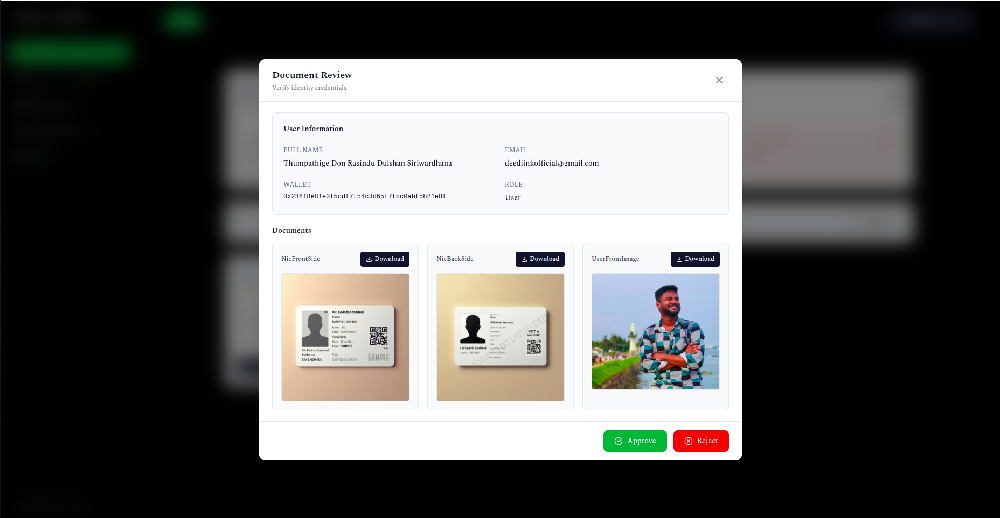

# 🌐 DeedLink  
### Blockchain-Powered Ecosystem for Real Estate Transactions  
**Tokenization • Deeds • Ownership Verification**

---

## 🏠 Overview
**DeedLink** revolutionizes property deed management through **blockchain technology**, providing a **secure, transparent**, and **efficient** platform for real estate transactions.  
It integrates **smart contracts**, **microservices**, and **decentralized storage** to create a **comprehensive digital property ecosystem**.

---

## ✨ Core Features
- 🏢 **Digital Property Deed Management**
- 🔗 **Blockchain-Based Transaction System**
- 📄 **Smart Contract Automation**
- 🗃️ **IPFS Document Storage (AWS + Pinata)**
- 👥 **Multi-Stakeholder Support**
- 📊 **Real-Time Transaction Tracking**
- 🔔 **Instant Notifications**
- 🧩 **Microservices Architecture**

---

## 🧱 System Architecture

### 🧩 Microservices
| Service | Description |
|----------|--------------|
| 🏠 **Deed Service** | Core property management |
| 💸 **Transaction Service** | Secure property transfers |
| 👤 **User Service** | Identity and authentication |
| 🗺️ **Survey Plan Service** | Property documentation |
| ☁️ **IPFS Service** | AWS S3 + IPFS document storage |
| 📦 **Pinata Service** | IPFS integration and pinning |
| 🔔 **Notification Service** | Real-time notifications and updates |

---

### 🧠 Smart Contracts
- 🏡 **Property NFT Management**
- 💰 **Fractional Ownership**
- 🪙 **Token Management (NFT/FT)**
- 🤝 **Escrow and Settlement Automation**

---

### 🖥️ Client Applications
| Application | Description | Repository |
|--------------|-------------|-------------|
| 🧑‍💼 **Property Owner Portal** | Manage and view owned deeds | [deedlink-client](https://github.com/DeedLink/deedlink-client) |
| 🛠️ **Admin Dashboard** | Supervision, analytics & validation | [admin-dashboard](https://github.com/DeedLink/admin-dashboard) |
| 🏛️ **Department Interface** | Government and institutional access | [departments-client](https://github.com/DeedLink/departments-client) |
| 🌍 **Block Visualizer** | Real-time blockchain transaction visualizer | [block-visualizer](https://github.com/DeedLink/block-visualizer) |

---

## 🖼️ Application Interfaces

> Showcase the user experience of each client app here.  
> Add screenshots or UI mockups below 👇

### 🛠️ Admin Dashboard

       
       
       
    

### 🏛️ Department Interface

#### Survey Department

       
     

#### IVSL Department

      

#### Notary Department

     

#### General Public

 
        
        
        
        
        
        
        
        
      

#### Email Based Verifications

     

## 🧩 Repository Structure

### 🧠 Microservices
- [`deed-service`](https://github.com/DeedLink/deed-service) – Core property management  
- [`transaction-service`](https://github.com/DeedLink/transaction-service) – Secure transfers  
- [`user-service`](https://github.com/DeedLink/user-service) – Identity management  
- [`survey-plan-service`](https://github.com/DeedLink/survey-plan-service) – Property documentation  
- [`ipfs-microservice`](https://github.com/DeedLink/ipfs-microservice) – Document storage  
- [`pinata-service`](https://github.com/DeedLink/pinata-service) – IPFS integration  
- [`Notification-Service`](https://github.com/DeedLink/Notification-Service) – Real-time notifications  

### 💡 Smart Contracts
- [`smartcontracts`](https://github.com/DeedLink/smartcontracts) – Property NFT Management  
- [`smartcontractsv2.0`](https://github.com/DeedLink/smartcontractsv2.0) – Enhanced contract features  
- [`NFT-FT`](https://github.com/DeedLink/NFT-FT) – Token management  

### 💻 Client Applications
- [`deedlink-client`](https://github.com/DeedLink/deedlink-client)  
- [`admin-dashboard`](https://github.com/DeedLink/admin-dashboard)  
- [`departments-client`](https://github.com/DeedLink/departments-client)  
- [`block-visualizer`](https://github.com/DeedLink/block-visualizer)  

### 🏢 Organization
- [`DeedLink/.github`](https://github.com/DeedLink/.github) – Organization profile & templates

---

## 👨‍💻 Team

### 🧱 Project Architecture and Development
**Dulshan Siriwardhana**  
- System Architecture  
- Smart Contract Development  
- Smart Contract Implementation  
- Web3 Integration  
- Microservices Architecture  
- API Development  
- Client Applications  

### 🎓 Advisors
**Dr. Prabath Weerasingha**  
- Technical Guidance  
- Research Direction  

---

## 🚀 Project Status
**🟢 Active Development:**  
Core features are implemented and currently undergoing **integration and system testing**.  
DeedLink demonstrates how **blockchain can reshape traditional property management**.

---

## 📊 Project Analytics

### 🧭 Organization Activity

## 📬 Contact
📧 **Email**: [deedlinkofficial@gmail.com](mailto:deedlinkofficial@gmail.com)  
🌐 **GitHub Organization**: [github.com/DeedLink](https://github.com/DeedLink)

---

## 🧠 Tech Stack
| Category | Technologies |
|-----------|---------------|
| **Frontend** | React, TypeScript, Vite, Tailwind CSS |
| **Backend** | Node.js, Express, MongoDB, Microservices |
| **Blockchain** | Solidity, Hardhat, Ethers.js |
| **Storage** | IPFS, Pinata, AWS S3 |

---

### 🌟 “Transforming Real Estate Through Blockchain Transparency.”